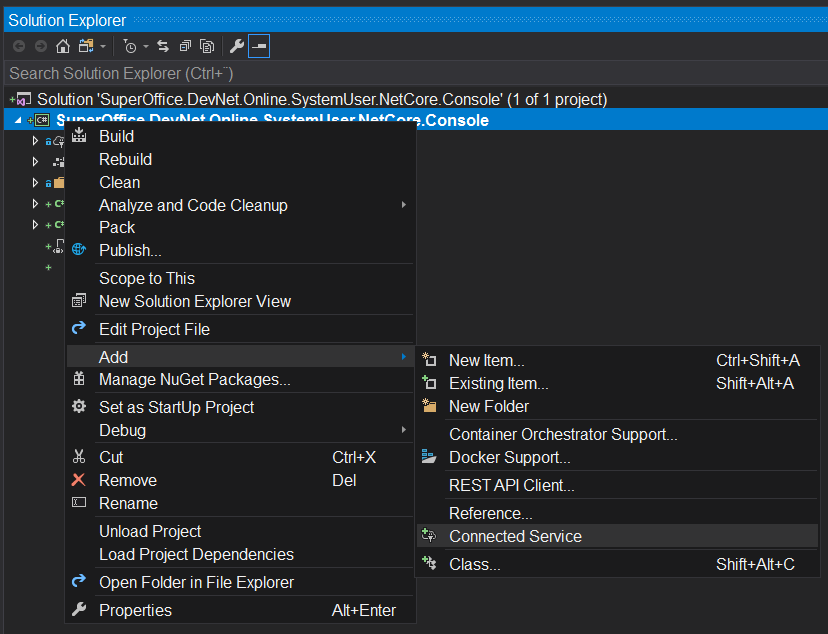
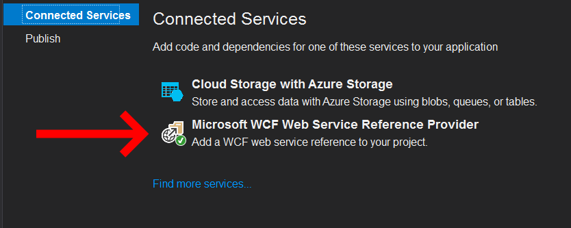
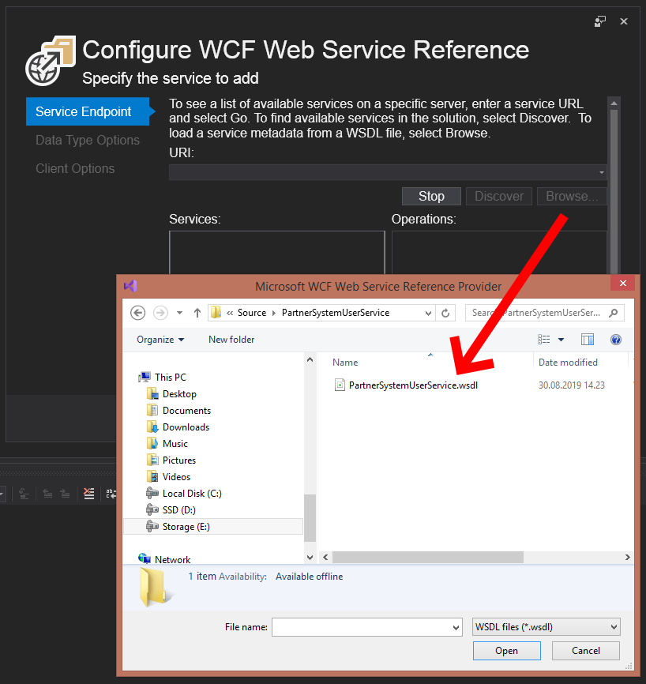
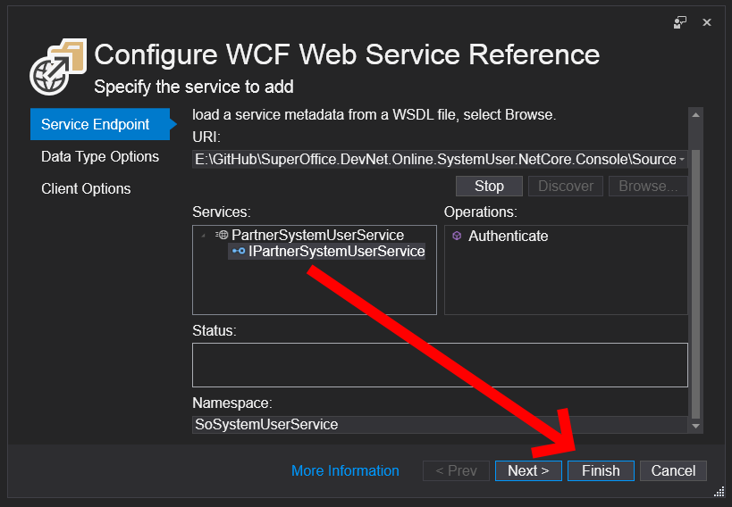
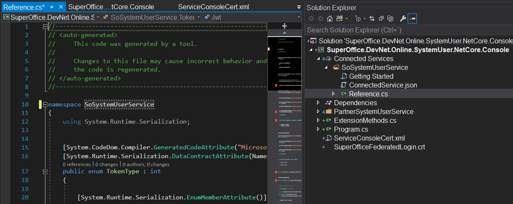

# SuperOffice.DevNet.Online.SystemUser.NetCore.Console

Application that demonstrates how to use .NET Core (2.2) and exchange a SuperOffice Online system user token for a system user ticket.

## Switching Between Envionments

Remember that some settings must be changed between the environments: SOD, STAGE and PRODUCTION!

All code dependencies reside in the Constants class...

```csharp
public static class Constants
{

    /**************************************************************************
    *** When migrating between SOD, STAGE and PRODUCTION **********************
    *** 1) Change ServiceConsoleCert.xml and SuperOfficeFederatedLogin.cert ***
    *** 2) Change the following constant values *******************************
    ************||||||||||||||||||||||||||||||||||||||||||||||||||*************
    ************\/\/\/\/\/\/\/\/\/\/\/\/\/\/\/\/\/\/\/\/\/\/\/\/\/************/

    // set the environment system user endpoint (sod, stage, online)

    public const string SystemUserEndpoint = "https://sod.superoffice.com/Login/services/PartnerSystemUserService.svc";

    // App Secret / Token

    public const string ApplicationToken = "YOUR_APPLICATION_TOKEN";

    // Application System User Token

    public const string SystemUserToken = "YOUR_APPLICATION_NAME-SomeRandomCode";

    // Customer ContextIdentifier

    public const string ContextIdentifier = "YOUR_TENANT_CONTEXT_IDENTIFIER";

    /*****^^^^^^^^^^^^^^^^^^^^^^^^^^^^^^^^^^^^^^^^^^^^^^^^^^^^^^^^^^^^^^*******
    ******||||||||||||||||||||||||||||||||||||||||||||||||||||||||||||||*******
    ****** Change these values between SOD, Stage and Production **************
    **************************************************************************/
}

```

Also, __update__ the following two files:

1. __ServiceConsoleCert.xml__ (Contains your applications PRIVATE key)
2. __SuperOfficeFederatedLogin.crt__ (Is the PUBLIC SuperOffice certificate)

----

## Getting Started From Scratch

This has already been done in the example source code, but if you want to start from scratch, this is how I did it.

Create a .net core console application. Right-click project and in the Add menu, click Connected Service.



In the Connected Services pane, click the __Microsoft WCF Web Services Reference Provider__ option.



In the Configure WCF Web Service Reference pain, click __Browse__, then locate and select the __PartnerSystemUserService.wsdl__ file.



When the service definition has finished loading, expand the available Services and click the __IPartnerSystemUserService__ interface, then click __Finish__.



Observe the generated code based on the WSDL definition.



Review the code in the project to see how to call this SOAP service and exchange a system user token for a system user ticket.
